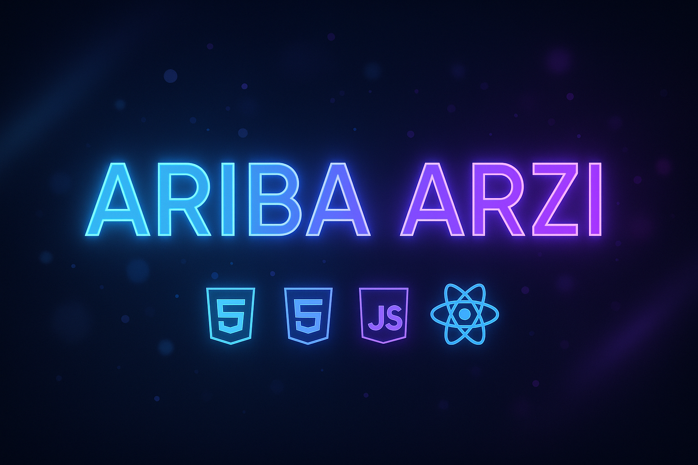

<!-- Banner -->

  

<!-- Typing SVG -->

  

---

## 🧑‍💻 About Me  
- 🎓 **Learning:** Full Stack Web Development (HTML, CSS, JS → React → Backend).  
- 🚀 **Contributor:** GSSoC 2025 Contributor.  
- 🎯 **Focused On:** Crafting modern, responsive, and user-friendly web apps.  
- 💡 **Goal:** Build beautiful & meaningful digital products while exploring **AI-powered apps**.  
- ⚡ **Interests:** UI/UX, gamified experiences, and product management.

---

## 🛠️ Tech Stack & Tools  

  

---

## 🚀 Highlights & Goals  

- 🌟 **Open Source Contributor:** Selected for **GSSoC 2025**.  
- 💻 **Current Project:** PausePal – A productivity & wellness app with advanced features.  
- 📚 **Learning Path:** React, backend development, and full-stack principles.  
- 🎨 **Strength:** Designing modern UI/UX with a focus on usability.  
- 🏆 **Future Goal:** Become a full-stack developer and build impactful AI-powered products.

---
## 🌐 Connect With Me  

  

---
